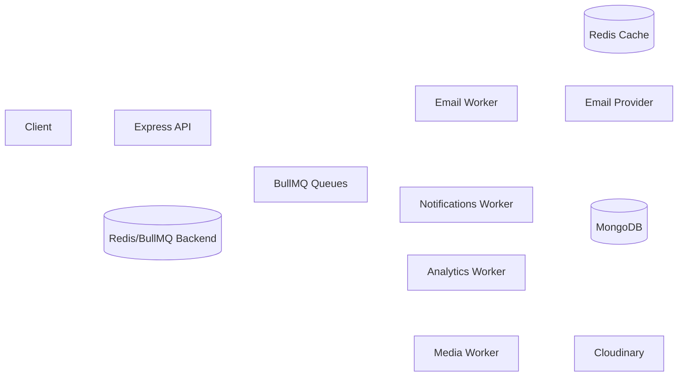

# 🚀 Social Media App API

_A scalable social media with intelligent recommendations and personalized trending.  
Built with Express, MongoDB, Redis, and BullMQ, featuring async workers, intelligent caching, queue-driven architecture, and a recommendation engine that blends global engagement signals with user interests._

## 🌟 Biggest Features First

### 1) ⚡ Event-Driven Background Processing (BullMQ + Redis)
### 2) 🤖 Personalized Discovery + Channel Analytics
### 3) ⚙️ Multi-Layer Performance Strategy
### 4) 🛠 Operational Readiness
### 5) 🔐 Security and Access Control

---

## 🛠️ Tech Stack

- Runtime: Node.js (ESM), Express 5
- Database: MongoDB (Mongoose)
- Queue/Jobs: BullMQ + Redis
- Auth: JWT + Passport Google OAuth
- Media: Cloudinary
- Search: Elasticsearch (reindex script available)
- Testing: Jest
- Deployment: Docker + GitHub Actions

---

## 🏗️ Project System Design 

- API Layer: routes + controllers
- Domain/Data Layer: models
- Async Layer: queues + workers
- Infra Utilities: cache, logger, cloudinary, notifications, scoring

Typical async flow:
1. API receives request and validates input.
2. Controller writes critical data quickly.
3. Non-critical work is enqueued (email/media/analytics/notification).
4. Worker processes job and updates persistence/cache.



---

## 🖥️ Local Setup

### Prerequisites
- Node.js 20+
- Docker + Docker Compose (recommended for full stack)

### Install

```bash
npm ci
```

### Run with Docker (recommended)

```bash
docker compose up -d
docker compose ps
docker compose logs app -f
```

### Run directly (API only)

```bash
npm start
```

If running directly, ensure MongoDB and Redis are already reachable.

---

## 📝 Environment Variables

Add these to your `.env` file:

```env
# Core
MONGODB_URI=your_mongodb_uri
REDIS_URL=your_redis_url
PORT=3000
JWT_SECRET_KEY=your_jwt_secret
ACCESS_TOKEN_EXPIRY=1d
BCRYPT_SALT_ROUNDS=10

# Google OAuth
GOOGLE_CLIENT_ID=your_google_client_id
GOOGLE_CLIENT_SECRET=your_google_client_secret
GOOGLE_CALLBACK_URL=your_google_callback_url

# Cloudinary
CLOUDINARY_CLOUD_NAME=your_cloud_name
CLOUDINARY_API_KEY=your_api_key
CLOUDINARY_API_SECRET=your_api_secret

# Email
MAIL_SENDER=your_email_address
NODEMAILER_PASSWORD=your_email_password

# Frontend
FRONTEND_URL=https://your-frontend-url.com
```

---

## 🧰 Scripts

- npm test
- npm run test:coverage-map
- npm run load:test
- npm run reindex:es

---

## 📚 API Documentation

**Auth labels:**
- Public: No token required
- Auth: Authenticated user required
- Optional: Works with or without auth context
- Admin: Admin-only route

### 👤 Authentication & Users
- `POST /api/v1/users/signup` — Register a new user (Public)
- `POST /api/v1/users/login` — User login (Public)
- `GET /api/v1/users/google` — Google OAuth login (Public)
- `GET /api/v1/users/google/callback` — Google OAuth callback (Public)
- `POST /api/v1/users/password-reset` — Request password reset (Public)
- `PATCH /api/v1/users/confirm-reset-password` — Confirm password reset (Public)
- `PATCH /api/v1/users/change-password` — Change password (Auth)
- `GET /api/v1/users/@:username` — Get user profile (Public)
- `PUT /api/v1/users/@:username` — Update user profile (Auth)
- `PATCH /api/v1/users/@:username/profile-pic` — Update profile picture (Auth)
- `PATCH /api/v1/users/@:username/cover` — Update cover image (Auth)

### 📺 Videos
- `GET /api/v1/videos` — List all videos (Public)
- `GET /api/v1/videos/trending` — Get trending videos (Public)
- `POST /api/v1/videos` — Upload a new video (Auth)
- `GET /api/v1/videos/my-videos` — List my uploaded videos (Auth)
- `GET /api/v1/videos/recommendations` — Get personalized recommendations (Auth)
- `GET /api/v1/videos/:id` — Get video by ID (Optional)
- `PUT /api/v1/videos/:id` — Update video (Auth)
- `PATCH /api/v1/videos/:id` — Toggle publish/update video (Auth)
- `DELETE /api/v1/videos/:id` — Delete video (Auth)

### 💬 Comments
- `GET /api/v1/comments/:commentId` — Get comment by ID (Public)
- `GET /api/v1/comments/video/:videoId` — List comments for a video (Public)
- `POST /api/v1/comments/:videoId` — Add a comment to a video (Auth)
- `POST /api/v1/comments/reply/:commentId` — Reply to a comment (Auth)
- `PATCH /api/v1/comments/:commentId` — Update a comment (Auth)
- `DELETE /api/v1/comments/:commentId` — Delete a comment (Auth)
- `GET /api/v1/comments/reply/:commentId` — List replies to a comment (Public)

### 👍 Likes
- `POST /api/v1/likes` — Like a video (Auth)
- `DELETE /api/v1/likes` — Unlike a video (Auth)
- `POST /api/v1/likes/comment` — Like a comment (Auth)
- `DELETE /api/v1/likes/comment` — Unlike a comment (Auth)

### 🔔 Subscriptions
- `GET /api/v1/subscriptions` — List my subscriptions (Auth)
- `POST /api/v1/subscriptions` — Subscribe to a channel (Auth)
- `DELETE /api/v1/subscriptions` — Unsubscribe from a channel (Auth)
- `GET /api/v1/subscriptions/subscribers` — List channel subscribers (Auth)
- `PATCH /api/v1/subscriptions/notifications` — Toggle subscription notifications (Auth)

### 📨 Notifications
- `GET /api/v1/notifications` — List notifications (Auth)
- `PATCH /api/v1/notifications/read` — Mark all as read (Auth)
- `PATCH /api/v1/notifications/read/:notificationId` — Mark notification as read (Auth)
- `DELETE /api/v1/notifications/:notificationId` — Delete notification (Auth)

### ⏰ Watch Later
- `GET /api/v1/watch-later` — List watch later videos (Auth)
- `POST /api/v1/watch-later` — Add video to watch later (Auth)
- `DELETE /api/v1/watch-later/:videoId` — Remove video from watch later (Auth)

### 📑 Playlists
- `POST /api/v1/playlists` — Create a playlist (Auth)
- `DELETE /api/v1/playlists/:playlistId` — Delete a playlist (Auth)
- `PUT /api/v1/playlists/:playlistId` — Update a playlist (Auth)
- `GET /api/v1/playlists/:userId/user` — List user playlists (Optional)
- `POST /api/v1/playlists/:playlistId/videos` — Add video to playlist (Auth)
- `GET /api/v1/playlists/:playlistId/videos` — List videos in playlist (Optional)
- `DELETE /api/v1/playlists/:playlistId/videos/:videoId` — Remove video from playlist (Auth)

### 🚩 Reports
- `POST /api/v1/reports` — Report content (Auth)
- `GET /api/v1/reports` — List my reports (Auth)
- `GET /api/v1/reports/:reportId` — Get report by ID (Auth)

### 🕒 Watch History
- `GET /api/v1/watch-history` — List watch history (Auth)
- `DELETE /api/v1/watch-history` — Clear watch history (Auth)
- `DELETE /api/v1/watch-history/:historyId` — Remove entry from history (Auth)

### 📊 Channels
- `GET /api/v1/channels/analytics` — Get channel analytics (Auth)

### 🛡️ Admin
- `GET /api/v1/admin/reports` — List all reports (Admin)
- `GET /api/v1/admin/reports/:reportId` — Get report by ID (Admin)
- `PUT /api/v1/admin/reports/:reportId` — Update report status (Admin)
- `GET /api/v1/admin/users` — List all users (Admin)
- `GET /api/v1/admin/users/:userId` — Get user by ID (Admin)
- `DELETE /api/v1/admin/users/:userId` — Delete user (Admin)
- `GET /api/v1/admin/users/:userId/videos` — List user's videos (Admin)
- `GET /api/v1/admin/users/:userId/comments` — List user's comments (Admin)
- `GET /api/v1/admin/videos` — List all videos (Admin)
- `GET /api/v1/admin/videos/:videoId` — Get video by ID (Admin)
- `DELETE /api/v1/admin/videos/:videoId` — Delete video (Admin)
- `GET /api/v1/admin/comments` — List all comments (Admin)
- `GET /api/v1/admin/comments/:commentId` — Get comment by ID (Admin)
- `DELETE /api/v1/admin/comments/:commentId` — Delete comment (Admin)


---

## 🗂️ Project Structure

```plaintext
Social-Media-App/
├── app.js                    # Main Express application file
├── package.json              # Project metadata, dependencies, and scripts
├── Dockerfile                # Docker image build instructions
├── docker-compose.yml        # Multi-service orchestration (MongoDB, Redis, workers)
├── config/                   # Configuration files
│   ├── config.js             # General project configuration
│   ├── mongodb.js            # MongoDB connection setup
│   └── transporter.js        # Email server configuration
├── controllers/              # Express route controllers (API logic)
│   ├── admin.js              # Admin API logic
│   ├── channel.js            # Channel analytics endpoints
│   ├── comment.js            # Comments management
│   ├── like.js               # Likes/dislikes management
│   ├── notification.js       # System notifications endpoints
│   ├── playlist.js           # Playlist management
│   ├── report.js             # Reports/flagging logic
│   ├── subscription.js       # User channel subscriptions
│   ├── user.js               # User authentication/profile logic
│   ├── video.js              # Video upload and management
│   ├── watchHistory.js       # Watch history endpoints
│   └── watchLater.js         # Watch Later feature endpoints
├── middlewares/              # Express middleware (auth, error, cache, uploads...)
│   ├── cache.js              # Response caching middleware (Redis)
│   ├── error.js              # Centralized error handling
│   ├── googleAuth.js         # Google OAuth setup
│   ├── isAdmin.js            # Admin route protection
│   ├── isAuth.js             # JWT authentication check
│   └── multer.js             # File upload handling
├── models/                   # MongoDB schemas via Mongoose
│   ├── channelAnalytics.js
│   ├── comment.js
│   ├── like.js
│   ├── notification.js
│   ├── playlist.js
│   ├── report.js
│   ├── subscription.js
│   ├── user.js
│   ├── userInteraction.js
│   ├── userInterest.js
│   ├── video.js
│   ├── videoCategory.js
│   ├── watchHistory.js
│   └── watchLater.js
├── routes/                   # API endpoint routing files
│   ├── admin.js
│   ├── channel.js
│   ├── comment.js
│   ├── like.js
│   ├── notification.js
│   ├── playlist.js
│   ├── report.js
│   ├── subscription.js
│   ├── user.js
│   ├── video.js
│   ├── watchHistory.js
│   └── watchLater.js
├── validation/               # Joi schema validation & request validators
│   ├── adminValidation.js
│   ├── commentValidation.js
│   ├── likeValidation.js
│   ├── notificationValidation.js
│   ├── playlistValidation.js
│   ├── reportValidation.js
│   ├── subscriptionValidation.js
│   ├── userValidation.js
│   ├── validateRequest.js
│   ├── videoValidation.js
│   ├── watchHistoryValidation.js
│   └── watchLaterValidation.js
├── docs/                     # Additional architecture and API documentation
├── queues/                   # BullMQ queue initializers for background jobs
│   ├── analyticsQueue.js
│   ├── emailQueue.js
│   ├── mediaQueue.js
│   └── notificationsQueue.js
├── scripts/                  # Helper scripts (coverage, reindexing, etc.)
│   └── checkHandlerCoverage.js
├── uploads/                  # Uploaded media files (storage location)
├── utils/                    # Utility/helper functions
│   ├── addToWatchHistory.js
│   ├── APIError.js
│   ├── apiLimiter.js
│   ├── APIResponse.js
│   ├── cloudinary.js
│   ├── computePersonalizedScore.js
│   ├── computeVideoScore.js
│   ├── createNotification.js
│   ├── createUserInteraction.js
│   ├── logger.js
│   ├── redisCache.js
├── workers/                  # Dedicated BullMQ workers for background jobs
│   ├── analyticsWorker.js
│   ├── emailWorker.js
│   ├── mediaWorker.js
│   └── notificationsWorker.js
├── __tests__/                # Unit tests
│   └── unit/
│       ├── controllers/      # Controller unit tests
│       └── utils/           # Utility function unit tests
├── LICENSE                   # License file
├── README.md                 # Project documentation
```

---

## 👤 Authors

- **Eslam Saeed** ([Eslamsaeed880](https://github.com/Eslamsaeed880)) — Primary author and maintainer

---

## 📄 License

This project is licensed under the [MIT License](./LICENSE).  
See the LICENSE file for details.

---
